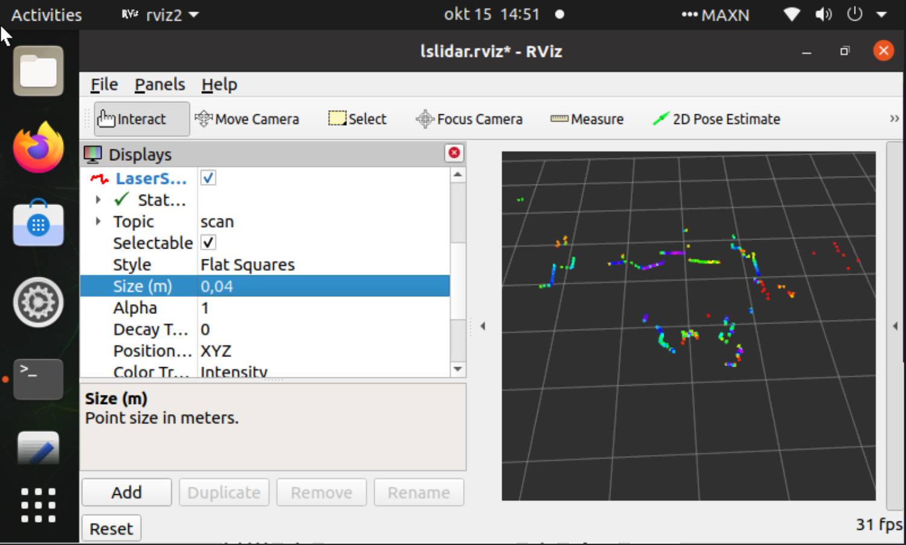

# Дневник

## Сборка образа 22.04 для Jetson Nano

```
just build-jetson-rootfs 22.04
just build-jetson-image -b jetson-nano -r 300 -l 32
just flash-jetson-image jetson.img <device>
```

## Проблемы с доступом к ~~джойказино~~ доменным именам

https://github.com/pythops/jetson-image/issues/123


Создать файл `custom.conf`:

```
sudo vi /etc/systemd/resolved.conf.d/custom.conf
```

Вставить в файл:

```
[Resolve]
DNS=8.8.8.8 8.8.4.4
```

Создать симлинку /etc/resolv.conf -> /run/systemd/resolve/resolv.conf

```
rm -f /etc/resolv.conf
ln -sv /run/systemd/resolve/resolv.conf /etc/resolv.conf
```

Перезапустить systemd-resolved:

```
sudo systemctl restart systemd-resolved
```

После этого интернет должен работать.


## Установка графического окружения

Устанавливаем xfce4 и lightdm:

```
sudo apt install -y xfce4 lightdm
```

## Настройка WiFi (not verified)

```
sudo apt install -y backport-iwlwifi-dkms
```

```
# https://losst.pro/oshibka-add-apt-repository-command-not-found
sudo apt install software-properties-common
```

## Установка ROS2 Humble

https://docs.ros.org/en/humble/Installation/Ubuntu-Install-Debs.html

## Unminimize

https://github.com/pythops/jetson-image/issues/134

Потом

```
sudo unminimize
```

```
sudo yes | unminimize
```

# Образ 18.04 из исходных

После неудачных попыток прошить робота через Jetson Image было принято решение скопировать образ zmrobo и вернуть к заводским настройкам.

Копирование и уменьшение образа:

https://askubuntu.com/a/1174509

Возврат к заводским настройкам:

https://askubuntu.com/a/1060599
https://github.com/gaining/Resetter

Однако Resetter не завелся, способ нерабочий

# Попытка установить 18.04 с нуля

https://github.com/dnovischi/jetson-tutorials/blob/main/jetson-nano-ubuntu-18-04-install.md
https://github.com/dnovischi/jetson-tutorials/blob/main/jetson-nano-ubuntu-20-04-install.md

Не попробована в связи с необходимостью делать приколы с образами и проводами

# Попытка еще одна установить 20.04

Тут используется уже готовый образ 20.04

https://github.com/Qengineering/Jetson-Nano-Ubuntu-20-image?tab=readme-ov-file#bare-image

## Post install
```
sudo apt update
sudo apt upgrade

echo "
export PATH=${PATH}:/usr/local/cuda/bin
export LD_LIBRARY_PATH=${LD_LIBRARY_PATH}:/usr/local/cuda/lib64" >> .bashrc
```

## Testing CUDA
```
/usr/local/cuda-10.2/bin/cuda-install-samples-10.2.sh .
cd NVIDIA_CUDA-10.2_Samples/
make HOST_COMPILER=/usr/bin/g++-7
./bin/aarch64/linux/release/deviceQuery
```

Should be like this:
```
./bin/aarch64/linux/release/deviceQuery Starting...

CUDA Device Query (Runtime API) version (CUDART static linking)

Detected 1 CUDA Capable device(s)

Device 0: "NVIDIA Tegra X1"
CUDA Driver Version / Runtime Version          10.2 / 10.2
CUDA Capability Major/Minor version number:    5.3
Total amount of global memory:                 3964 MBytes (4156399616 bytes)
( 1) Multiprocessors, (128) CUDA Cores/MP:     128 CUDA Cores
GPU Max Clock rate:                            998 MHz (1.00 GHz)
Memory Clock rate:                             13 Mhz
Memory Bus Width:                              64-bit
L2 Cache Size:                                 262144 bytes
Maximum Texture Dimension Size (x,y,z)         1D=(65536), 2D=(65536, 65536), 3D=(4096, 4096, 4096)
Maximum Layered 1D Texture Size, (num) layers  1D=(16384), 2048 layers
Maximum Layered 2D Texture Size, (num) layers  2D=(16384, 16384), 2048 layers
Total amount of constant memory:               65536 bytes
Total amount of shared memory per block:       49152 bytes
Total number of registers available per block: 32768
Warp size:                                     32
Maximum number of threads per multiprocessor:  2048
Maximum number of threads per block:           1024
Max dimension size of a thread block (x,y,z): (1024, 1024, 64)
Max dimension size of a grid size    (x,y,z): (2147483647, 65535, 65535)
Maximum memory pitch:                          2147483647 bytes
Texture alignment:                             512 bytes
Concurrent copy and kernel execution:          Yes with 1 copy engine(s)
Run time limit on kernels:                     Yes
Integrated GPU sharing Host Memory:            Yes
Support host page-locked memory mapping:       Yes
Alignment requirement for Surfaces:            Yes
Device has ECC support:                        Disabled
Device supports Unified Addressing (UVA):      Yes
Device supports Compute Preemption:            No
Supports Cooperative Kernel Launch:            No
Supports MultiDevice Co-op Kernel Launch:      No
Device PCI Domain ID / Bus ID / location ID:   0 / 0 / 0
Compute Mode:
   < Default (multiple host threads can use ::cudaSetDevice() with device simultaneously) >

deviceQuery, CUDA Driver = CUDART, CUDA Driver Version = 10.2, CUDA Runtime Version = 10.2, NumDevs = 1
Result = PASS
```

## ROS Install

Здесь инструкция по настройке и установке ROS2 Humble через докер контейнер. Это сработало, однако не совсем понятно как работать с ROS2 через докер.

https://github.com/CollaborativeRoboticsLab/JetsonNano-ROS2/blob/main/docs/u20-humble-Docker-Desktop.md

Планирую поставить ROS Foxy нативный для Ubuntu 20.04 прямо на убунту:

https://github.com/CollaborativeRoboticsLab/JetsonNano-ROS2/blob/main/docs/u20-foxy-noDocker-Desktop.md

```
locale  # check for UTF-8

sudo apt update && sudo apt install locales
sudo locale-gen en_US en_US.UTF-8
sudo update-locale LC_ALL=en_US.UTF-8 LANG=en_US.UTF-8
export LANG=en_US.UTF-8

locale  # verify settings
```

```
sudo apt install software-properties-common
sudo add-apt-repository universe

sudo apt update && sudo apt install curl -y
sudo curl -sSL https://raw.githubusercontent.com/ros/rosdistro/master/ros.key -o /usr/share/keyrings/ros-archive-keyring.gpg

echo "deb [arch=$(dpkg --print-architecture) signed-by=/usr/share/keyrings/ros-archive-keyring.gpg] http://packages.ros.org/ros2/ubuntu $(. /etc/os-release && echo $UBUNTU_CODENAME) main" | sudo tee /etc/apt/sources.list.d/ros2.list > /dev/null

sudo apt update
sudo apt upgrade

sudo apt install ros-foxy-desktop python3-argcomplete
sudo apt install ros-dev-tools

echo "
source /opt/ros/foxy/setup.bash" >> .bashrc
```

## VNC

https://github.com/Qengineering/Jetson-Nano-Ubuntu-20-image?tab=readme-ov-file#vnc

# Настройка железа

## Драйвер лидара

У нас лидар LSLidar N10

https://github.com/nodehubs/Lslidar_ROS2_driver/tree/develop#


<!-- https://github.com/Lslidar/Lslidar_ROS2_driver

У нас лидар LSLidar N10

```
git clone -b N0_V1.0 https://github.com/Lslidar/Lslidar_ROS2_driver.git
``` -->

Драйверу необходим ряд пакетов для компиляции:

```
sudo apt install ros-foxy-diagnostic-updater
sudo apt-get install libpcap-dev
```

Для юарта:

```
sudo gpasswd --add ${USER} dialout
newgrp dialout
```

Чтобы проверить работу лидара:

```
ros2 launch lslidar_driver lslidar_launch.py
```

Теперь в топик \scan будет поток данных с лидара.


